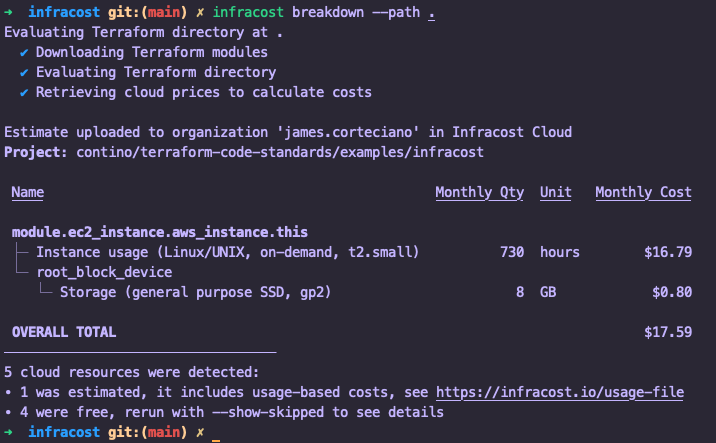
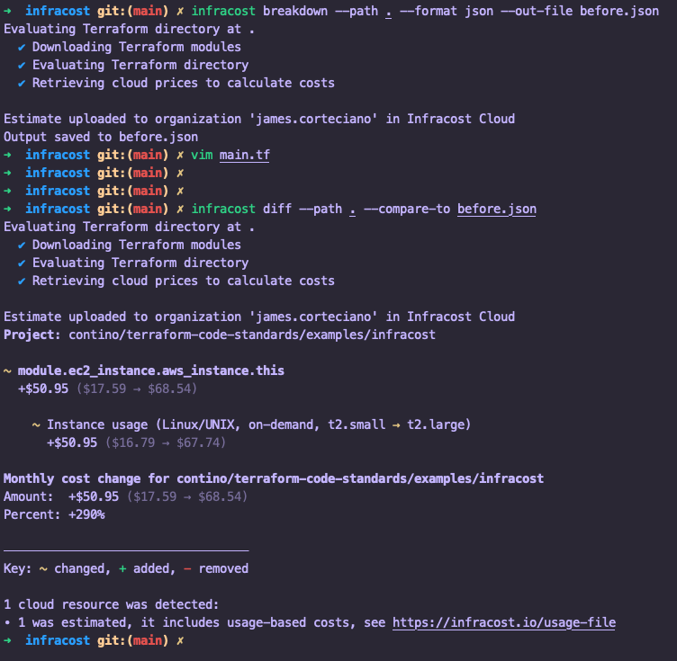
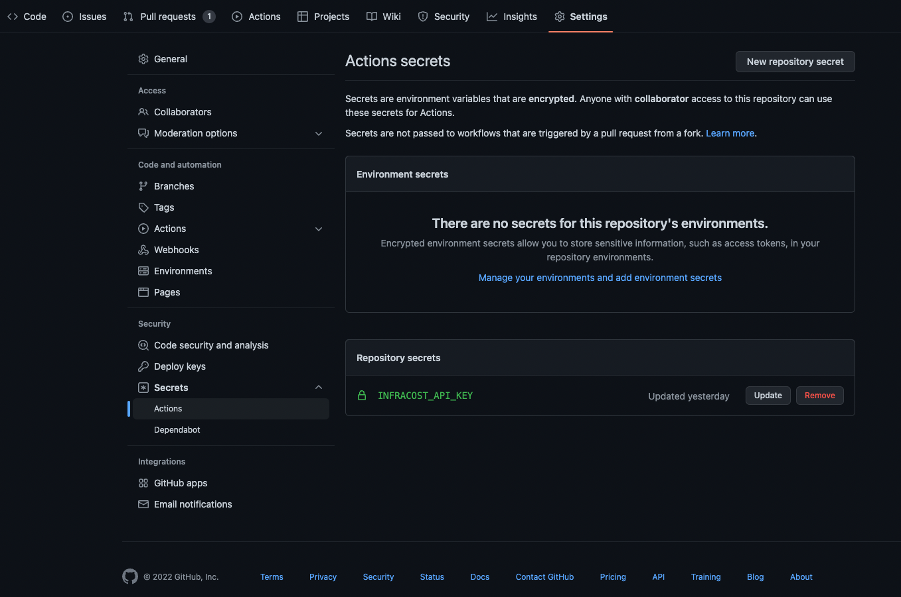
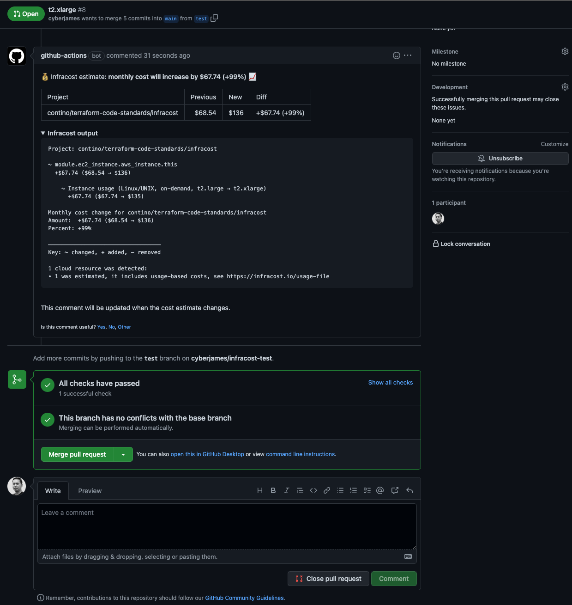

# Infracost

- [Introduction](#introduction)
- [Objectives](#objectives)
- [Implementation](#implementation)
    - [Step 1 - Installing Infracost](#step-1-installing-infracost)
    - [Step 2 - Register for Infracost API Key](#step-2-register-for-infracost-api-key)
    - [Step 3 - Running Infracost CLI](#step-3-running-infracost-cli)
- [CI/CD Integrations](#cicd-integrations)
- [Other Useful Handy Information](#other-useful-handy-information)
- [Infracost Cloud](#infracost-cloud)

<br><br>

## Introduction
The [Infracost](https://www.infracost.io) offers two kinds of products - Community (an open source software) and Cloud (a SaaS product). 

Both product aims to show the cloud cost estimate with breakdowns and diffs to understand the costs before launching or making changes to the Infrastructure as Code configuration either in the terminal or pull requests from the VCS provider.
<br>

Terraform is the only supported IaC tool at the moment of this writing while the rest of the tools are still part of their [roadmap](https://github.com/infracost/infracost/projects/2) feature.

<br>

## Objectives
The main outcomes when using Infracost are:

- Cost visibility and awareness before resources are launched.

- Automated cloud costs with CI/CD integrations.

But on top of the Community version, the Infracost Cloud adds more features (details are [here](https://www.infracost.io/pricing)).
<br>
<br>

## Implementation


### Step 1: Installing Infracost

| **Platform**         | Commands                                                                                                                                                                                                                                        |
|----------------------|-------------------------------------------------------------------------------------------------------------------------------------------------------------------------------------------------------------------------------------------------|
| macOS (Brew)         | ```brew install infracost```                                                                                                                                                                                                               |
| macOS/Linux (Manual) | ```curl -fsSL https://raw.githubusercontent.com/infracost/infracost/master/scripts/install.sh \| sh```                                                                                                                                     |
| Docker               | ```docker pull infracost/infracost:ci-latest` ; docker run --rm -e INFRACOST_API_KEY=<your-infracost-api-key-here> -v $PWD/:/path/to/terraform/code/ infracost/infracost:ci-latest breakdown --path /path/to/terraform/code/ ``` |
| Windows (Chocolatey) | ```choco install infracost ```                                                                                                                                                                                                             |
| Windows (Manual)     | Download and unzip the latest release at https://github.com/infracost/infracost/releases/latest/download/infracost-windows-amd64.zip.                                                                                                           |


<br>

### Step 2: Register for Infracost API Key
Registration is <u>free</u> for getting an Infracost API key. To do that, issue the command below and it will navigate you to the infracost website registration page.

```bash
infracost auth login
```

Retrieve your Infracost API key with the command below.

```bash
infracost configure get api_key
```

Set your retrieved Infracost API key to your local computer.

```xml
infracost configure set api_key <your-infracost-api-key-here>
```

<br>

### Step 3: Running Infracost CLI
The following are examples of the basic commands for the Infracost CLI.<br>

<br>

#### ➡️ Showing an estimated cost <u>breakdown</u>

<br>
The example below will show an estimated cost breakdown for all the resources in the Terraform code.

```bash
cd /path/to/terraform-code-project

infracost breakdown --path .
```

Example output:




<br>

#### ➡️ Showing an estimated cost <u>diff</u>erence

The example below will show an estimated cost difference of before and after making changes to the resources (i.e. AWS instance type) in the Terraform code.

1. Generate a JSON file as the baseline.
    ```bash
    cd /path/to/terraform-code-project

    infracost breakdown --path . --format json --out-file before.json
    ```
2. Try to change any resources in the Terraform code like AWS instance type.
3.  Generate a differences by comparing the latest code change from the previous one.
    ```bash
    infracost diff --path . --compare-to before.json
    ```

Example output:

  


<br>

## CI/CD Integrations
Infracost can be integrated to multiple CI/CD systems. This tool is recommended to add in every pull requests.
<br><br>The example guide below is for GitHub Actions. The other provider (like GitLab, Jenkins, etc) guide can be found in [here](https://www.infracost.io/docs/integrations/cicd/).


#### ➡️ Using GitHub Actions

<details><summary>
<i>Show the content in here</i>
</summary>
<br>

Please visit the [Infracost GitHub Actions](https://github.com/infracost/actions) guide to explore other options and details.
<br>

1. [Create a Github repository secrets](https://docs.github.com/en/actions/security-guides/encrypted-secrets#creating-encrypted-secrets-for-a-repository) with the following details.
    - Name   = `INFRACOST_API_KEY`
    - Secret = `<Your Infracost API key>` 
  
  <br>

  


2. Create a file `.github/workflows/infracost.yml` with the contents below.
  ```yaml
  name: Infracost
  on: [pull_request]

  jobs:
    terraform-project:
      name: Terraform project
      runs-on: ubuntu-latest
      permissions:
        contents: read
        pull-requests: write

      env:
        # The location of the Terraform code
        TF_ROOT: ./

      steps:
        - name: Setup Infracost
          uses: infracost/actions/setup@v2
          with:
            api-key: ${{ secrets.INFRACOST_API_KEY }}

        # Checkout the base branch of the pull request (e.g. main/master).
        - name: Checkout base branch
          uses: actions/checkout@v3
          with:
            ref: '${{ github.event.pull_request.base.ref }}'

        # Generate Infracost JSON file as the baseline.
        - name: Generate Infracost cost estimate baseline
          run: |
            infracost breakdown --path=${TF_ROOT} \
                                --format=json \
                                --out-file=/tmp/infracost-base.json

        # Checkout the current PR branch so we can create a diff.
        - name: Checkout PR branch
          uses: actions/checkout@v3

        # Generate an Infracost diff and save it to a JSON file.
        - name: Generate Infracost diff
          run: |
            infracost diff --path=${TF_ROOT} \
                            --format=json \
                            --compare-to=/tmp/infracost-base.json \
                            --out-file=/tmp/infracost.json

        # Posts a comment to the PR using the 'update' behavior.
        # See https://www.infracost.io/docs/features/cli_commands/#comment-on-pull-requests for other options.
        - name: Post Infracost comment
          run: |
              infracost comment github --path=/tmp/infracost.json \
                                      --repo=$GITHUB_REPOSITORY \
                                      --github-token=${{github.token}} \
                                      --pull-request=${{github.event.pull_request.number}} \
                                      --behavior=update
  ```
3. Now, you can try to create a pull request to your GitHub repository and the workflow will be running automatically. 
  <br>A comment will be posted to the PR comment thread displaying an estimated cost outcome.
  <br><br>Below is an example of the Infracost output.

  
</details>

  <br>

  ➡️ Another example combination of the core Terraform workflow.
<details><summary>
<i>Show the content in here</i>
</summary>

  ```yml
  name: terraform-infracost
  on: [pull_request]

  jobs:
    infracost:
      runs-on: ubuntu-latest
      env:
        working-directory: ./
        AWS_ACCESS_KEY_ID:  ${{ secrets.AWS_ACCESS_KEY_ID }}
        AWS_SECRET_ACCESS_KEY:  ${{ secrets.AWS_SECRET_ACCESS_KEY }}  
        AWS_SESSION_TOKEN:  ${{ secrets.AWS_SESSION_TOKEN }}

      name: Run Infracost
      steps:
        - name: Check out repository
          uses: actions/checkout@v2
          
        - name: Install terraform
          uses: hashicorp/setup-terraform@v1
          with:
            terraform_wrapper: false # This is recommended so the `terraform show` command outputs valid JSON

        - name: Terraform init
          run: terraform init
          working-directory: ${{ env.working-directory }}

        - name: Terraform plan
          run: terraform plan -out tfplan.binary
          working-directory: ${{ env.working-directory }}

        - name: Terraform show
          run: terraform show -json tfplan.binary > plan.json
          working-directory: ${{ env.working-directory }}

        - name: Setup Infracost
          uses: infracost/actions/setup@v1
          with:
            api-key: ${{ secrets.INFRACOST_API_KEY }}

        - name: Set AUD Currency and Generate Infracost JSON
          run: |
            infracost configure set currency AUD
            infracost breakdown --path plan.json --format json --out-file /tmp/infracost.json
          working-directory: ${{ env.working-directory }}
          
        - name: Post Infracost comment
          uses: infracost/actions/comment@v1
          with:
            path: /tmp/infracost.json
            # Choose the commenting behavior, 'update' is a good default:
            behavior: update # Create a single comment and update it. The "quietest" 
  ```
  </details>
  <br>

  ➡️ Other use-case: [Generating plan JSON files](https://www.infracost.io/docs/troubleshooting/#2-generating-plan-json-files).


<br><br>

## Other Useful Handy Information

- The Infracost monthly pricing is automatically detected in the Terraform code based on the defined region (i.e. AWS Sydney region).

- The default currency is USD. You can change the format using the [Infracost CLI and environment variables](https://www.infracost.io/docs/features/environment_variables/#infracost_currency).
  ```bash
  infracost configure set currency AUD
  ```
  ```bash
  export INFRACOST_CURRENCY=AUD
  ```

<br>

## Infracost Cloud
Infracost Cloud is a Software as a Service (SaaS) product that builds on top of Infracost open source. It provides few [features](https://www.infracost.io/pricing/) such as a dashboard as a central place that shows all cost estimation for the entire pull requests from the VCS provider to help guide the team.

Please refer to this [link](https://www.infracost.io/docs/infracost_cloud/get_started/) to quickly get started with Infracost Cloud.